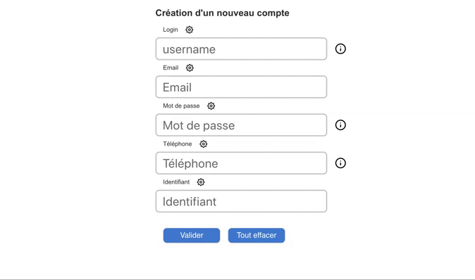

# React Redux Regex

Création automatique d'input à partir d'un tableau d'objet modifiable.

Exemple :

```js
export const data = [
  {
    name: "username",
    label: "Login",
    placeholder: "username",
    pattern: /^[a-z\d]{5,12}$/i,
    description: "Entre 5 - 12 charactères",
    patternDetail: [
      {
        pattern: /[^a-z\d]/i,
        message: "Uniquement des caractères alphanumériques",
        expected: false,
      },
      {
        pattern: /^.{5,12}$/,
        message: "Entre 5 et 12 caractères",
        expected: true,
      },
    ],
  },
];
```

- Les inputs non conformes ont une bordure orange.
- Les inputs valides ont une bordure verte.


### le bouton (!) permet d'avoir plus de détail sur les règles qui doivent être respectées pour valider la saisie.


### Démo Gif



### Todo

- Revoir le responsive
- Ajouter lien vers https://regex101.com/
